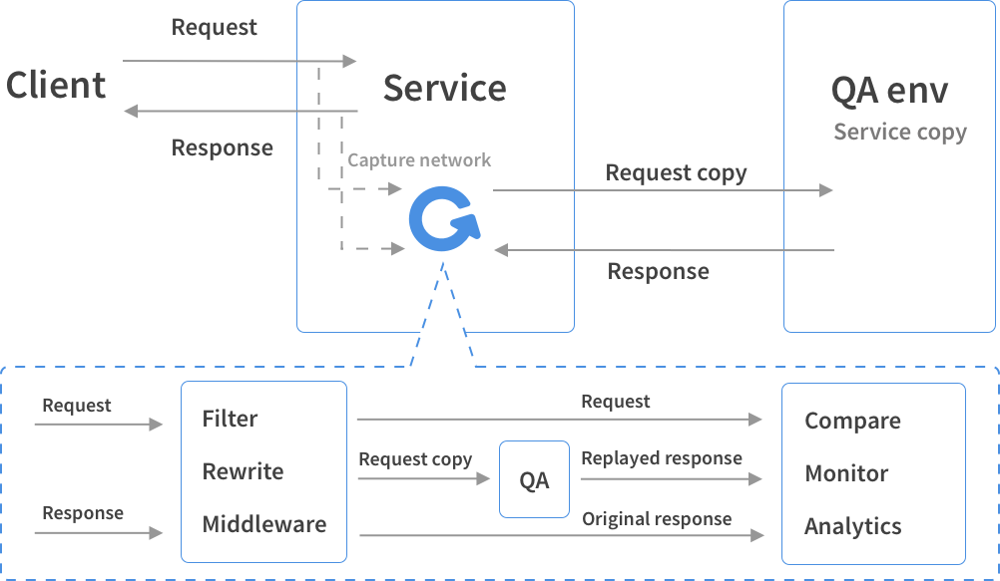

## Over All
Policy Match leverages [gor](https://github.com/buger/goreplay) to build a duplicator env. The middleware uses Node.


The gor with middleware is depolyed in PROD VM which is to de duplicated.

The target build is deployed on another new VM alone.

## 1. Prepare Evironment 
### 1.1 Prepare prod env 
Select an old APP machine as the target prod env
-	Should not be scaled in
-	Can visit the new deployed duplicator’s policy match port (now is 6666 in start_APP.sh)

```shell
cd /opt/MyCompany
sudo mkdir duplicate_test
cd /opt/MyCompany/duplicate_test
sudo mkdir log
```

#### 1.1.1 install gor
```shell
cd /opt/MyCompany/duplicate_test
sudo wget https://github.com/buger/goreplay/releases/download/v1.0.0/gor_1.0.0_x64.tar.gz
sudo tar xvf gor_1.0.0_x64.tar.gz
```

#### 1.1.2 install node
```shell
cd /opt/MyCompany/duplicate_test
sudo wget https://nodejs.org/dist/v10.13.0/node-v10.13.0-linux-x64.tar.gz
# sudo wget https://npm.taobao.org/mirrors/node/v10.13.0/node-10.13.0-linux-x64.tar.gz
sudo tar -xzvf node-v10.13.0-linux-x64.tar.gz
sudo ln -sfn /opt/MyCompany/duplicate_test/node-v10.13.0-linux-x64/bin/node /bin/node
```

### 1.2. Prepare target environment
#### 1.2.1 Build

**Never merge your code from test branch back to int or dev.**

OPTION 1:

Merge int to branch DuplicateTestNeverMergeToDevOrInt and do your modification.

OPTION 2:
- Branch on target code like int
- Return before other service type or provision type logic you do not want to test
- Comment on not readonly code, like DB(update/insert/lock), redis or HTTP API call which could infelct other environment like EWSsubscriber
- modify the spring port in application.yml and log path in log4j.properties if needed

Build to APP.jar by mvn

#### 1.2.2 VM
The new deployed duplicator machine should:
-	Based on APP server role
-	Do not start the policy or policy match service when VM boot
-	Do not let load balancer call it
-	Do not let nxlog send log to splunk
-	Do not let it visit redis or EWSsubscriber
-	Can read from DB

#### 1.2.3 Configure
- Use readonly account to connect DB
- Modify redis and EWSsubscriber configuration to illegal
- Change log file path if needed

#### 1.2.4 Depoly
Put APP_duplicator.jar to /opt/MyCompany/APP/
    
```shell
#scp -i id_rsa /home/cas-user/gavin/APP.jar cas-user@pom-00000F:~/
```

### 1.3. Prepare middleware 
#### 1.3.1 Build 

zip the folder src\test\nodejs\duplicator\duplicator_middleware to duplicator_middleware.zip
    
**Now the middleware only allows match and batchMatch API.** 

You can modify the code to adjust it. Gor command line --http-allow-url /allowedApi parameter seems to conflict with middleware logic.

Refer to https://github.com/buger/goreplay/tree/master/middleware for more information

#### 1.3.2 Deploy
put the duplicator_middleware.zip under /opt/MyCompany/duplicate_test

```shell
sudo unzip duplicator_middleware.zip
cd duplicator_middleware
sudo npm install (or you can run the npm install in build step)
```
    
## 2. Run Duplicate test

### 2.1 Start the target service

```shell
sudo monit start APP
#sudo sh start_APP.sh 
```

The log can be found in /var/log/APPservice.log

### 2.2 Start gor with middleware inside

Wait until the target service starts by
```shell
curl http://{IP}:{Port}/policy/APPCache/buildStatus    
#curl http://127.0.0.1:6666/policy/APPCache/buildStatus
```
Edit start_gor.sh to right IP and port
```shell
sudo sh /opt/MyCompany/duplicate_test/start_gor.sh
```

### 2.3 Veify the test work well

1. On the one side, you should always get the dismatch error with target id of "duplicator_error_sample@error.test.testdomain.com" (golden sample in DuplicateTestNeverMergeToDevOrInt branch).

2. On the other side, without golden sample, you should see no error but only scuesss count increases.

```shell
cat /var/log/APP_middleware.log |grep error | grep -v duplicator_error_sample

curl --header "Content-Type: application/json" \
  --request POST \
  --data '{"policyType":1,
  "policyMatchTargetInfoList":[{"companyId":"65942380-19e2-11e7-94a3-3dbfff631318", "userId":"success_test@test.testdomain.com"},{"companyId":"65942380-19e2-11e7-94a3-3dbfff631318", "userId":"duplicator_error_sample@error.test.testdomain.com"}]}' \
  http://192.168.39.5:8081/policy/batchMatch

curl -G -d 'companyId=65942380-19e2-11e7-94a3-3dbfff631318' -d 'policyType=1' --data-urlencode 'targetId=duplicator_error_sample@error.test.testdomain.com' http://192.168.39.5:8081/policy/match
```
 
    
## 3. Stop test
kill gor and Node process with sudo
    
## 4. Ananlyze test result
See the error log under /var/log/APP_middleware.log
    
## 5. Q&A  

I'm getting 'too many open files' error
Typical Linux shell has a small open files soft limit at 1024. You can easily raise that when you do this before starting your gor replay process:

```shell
ulimit -a //query the limit
ulimit -n 64000
```